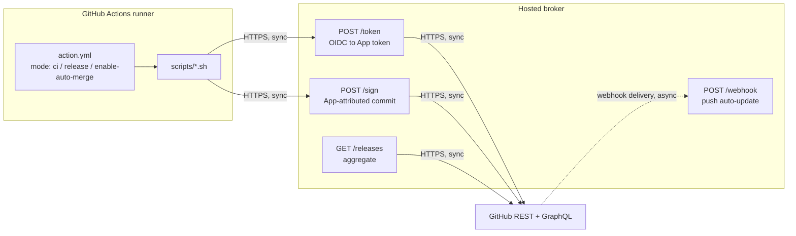

# Architecture

<!-- sources: action.yml, scripts, broker/app, worker/src/index.ts, .github/workflows -->

Diatreme is two independent surfaces in one repo. They talk over HTTP and share no
code. The action calls the worker's broker endpoints; the worker never calls the
action.

The action calls the broker. The broker never calls the action. Every call is
synchronous and the action fails hard on any fault, so a broker outage is a red
X on the release rather than a silent skip.

## The composite action

`action.yml` is deliberately thin glue (83 inputs, 44 steps); the real logic lives
in `scripts/*.sh`, which are `bats`-tested. Three modes:

- **`ci`**: build and push the `pr-<N>` Docker image, optionally enforce branch
  naming, and (optionally) run a Trivy scan whose CycloneDX SBOM is routed to
  Dependency-Track and whose findings are routed to DefectDojo. Reporting is
  visibility-first: non-blocking unless `image-scan-gate`, sinks are
  failure-isolated, and a scanner that cannot run is a build error (not a finding).
- **`release`**: resolve auth, determine the target environment, delegate
  versioning to the selected backend, normalize outputs, optionally promote the
  Docker image, publish a GitHub Release, and optionally open a promotion PR.
  Before promoting a `pr-<N>` image it verifies the image's provenance labels
  (stamped by `mode: ci`) against the release commit's git tree; stale or
  unverifiable images are rebuilt from the release checkout instead of promoted.
- **`enable-auto-merge`**: enable native GitHub auto-merge for a specific PR.

**Versioning backends** are selected by `versioning-tool` (default `auto`, which
detects from repository markers): `semantic-release-python`, `semantic-release-npm`,
`gitversion`, `release-please`.

## The broker

The broker is a GitHub App token minter: it exchanges an Actions OIDC token for
a short-lived installation token, so callers don't have to register and run their
own GitHub App.

The production broker (`broker/app`) is a Python implementation running on AWS
Lambda. The repository also contains `worker/src/index.ts`, a Cloudflare Worker
that serves as the rollback target and code reference, but does not currently
serve any hostname.

!!! note "Production broker is Python/Lambda"
    `broker/app` runs on AWS Lambda behind API Gateway in eu-west-1, serving
    both broker hostnames. The TypeScript Cloudflare Worker (`worker/`) remains
    the code-of-record reference and rollback target. See [Deployment](operations/deployment.md).

| Endpoint | Purpose | Auth |
| --- | --- | --- |
| `POST /token` | Exchange a GitHub Actions OIDC token for a short-lived App installation token. | OIDC (`id-token: write`) |
| `POST /sign` | Create a GitHub-signed, App/bot-attributed commit via `createCommitOnBranch`. | `Bearer PROCESS_TRIGGER_SECRET` |
| `GET /releases` | Aggregated latest-release history across installations, cached. Caps are reported via `truncated`, never applied silently. | `Bearer PROCESS_TRIGGER_SECRET` |
| Webhook `push` | Fast-forward open PRs targeting the pushed branch (opt-in). | HMAC (`GITHUB_WEBHOOK_SECRET`) |

OIDC verification pins the issuer before selecting its JWKS, so a forged `iss` can't
select a foreign key. **GitHub Enterprise** (ghe.com / GHES) is opt-in via the
`GHE_*` environment: a GHE token is verified against that tenant's issuer and minted
via the GHE App against the GHE REST/GraphQL base.

### Failure modes at the boundary

| Boundary | Fails how | Result |
| --- | --- | --- |
| Action to broker | Connection refused, DNS failure, or 5xx | The action retries once against the fallback hostname, then fails the step. A 4xx is never retried. |
| Broker to issuer JWKS | Timeout, non-200, unparseable body | `503 oidc_key_fetch_failed`, unless a last-known-good snapshot under 24 hours old can rescue the request. |
| Broker to GitHub REST | 404 on installation lookup | `404 app_not_installed`. Anything else unusable becomes a 500. |

The full table is in [Errors](reference/errors.md).

## Deliberate tradeoffs

**One hostname is a single point of failure, so the fallback ships inside the
action.** A broker hostname losing egress would block releases in every
repository pinned to every published version, and no change shipped later can
redirect those pins. The secondary hostname travels with the action itself.

**Frozen wire contract.** Consumers pin by SHA, so action input names, defaults
and behaviour, and the broker's response bodies, are append-only. That
constrains every change, and it's the price of being pinnable.

**Fail hard, not soft.** A broker fault could be swallowed and the release
allowed to continue unsigned or unversioned. Diatreme exits non-zero instead. A
loud failure is cheaper than a wrong release.

!!! note "Deeper map for contributors"
    `PROJECT_INDEX.json` at the repo root has the module and callgraph
    breakdown, and `AGENTS.md` has the repository boundary and editing rules.
